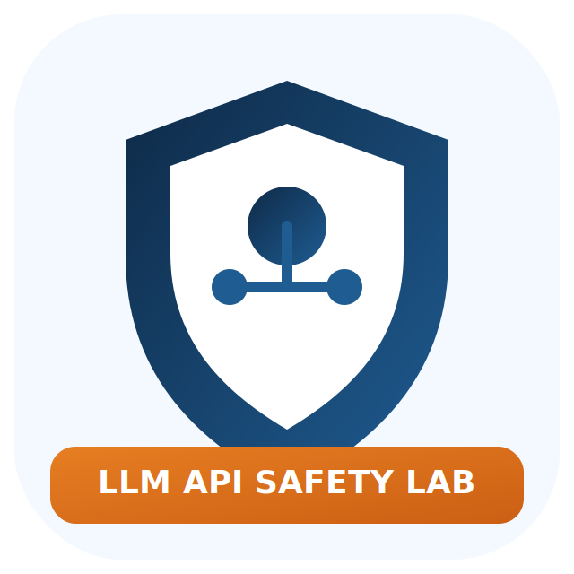

# LLM API Safety Lab

<p align="center">
  
</p>

<p align="center">
  Closed-loop research pipeline for <b>LLM API safety</b> in BYO-key deployments.
</p>

<p align="center">
  <a href="https://github.com/giao-123-sun/llm-api-safety-lab">Repository</a> |
  <a href="https://giao-123-sun.github.io/llm-api-safety-lab/">Project Website</a>
</p>

## Table of Contents

- [Overview](#overview)
- [Key Features](#key-features)
- [Architecture](#architecture)
- [Quick Start](#quick-start)
- [Configuration](#configuration)
- [Outputs](#outputs)
- [Project Structure](#project-structure)
- [Research Assets](#research-assets)
- [Roadmap](#roadmap)
- [Contributing](#contributing)
- [Security Notice](#security-notice)

## Overview

`LLM API Safety Lab` is an engineering-first research project that evaluates safety risks when users provide their own:

- `api_key`
- `baseurl`
- `model`

The pipeline runs end-to-end:

1. research and source collection
2. threat scenario construction
3. baseline/defense experiments
4. ablation analysis
5. chart and report generation
6. website publishing

## Key Features

- Multi-profile safety ablation (`baseline` to `full_stack`)
- Structured policy-gateway decision simulation
- Built-in prompt/tool/MCP abuse scenarios
- Auto-generated charts and markdown reports
- Related-work comparison with downloaded papers
- GitHub Pages website generation

## Architecture

```text
idea.txt
  -> run_pipeline.py
     -> src/experiment_runner.py
        -> results/raw_results.csv
        -> results/summary.csv
     -> src/reporting.py
        -> results/*.png + results/*.md
     -> assets/generated/*.png
  -> scripts/render_site.py
     -> docs/index.html + docs/static/*
  -> scripts/publish_github.py
     -> GitHub repo + Pages
```

## Quick Start

```bash
pip install -r requirements.txt
python run_pipeline.py
python scripts/render_site.py
python scripts/publish_github.py
```

## Configuration

Create local config files:

- `config/key.txt`
- `config/github_key.txt`

Expected keys in `config/key.txt`:

```ini
baseurl=https://openrouter.ai/api/v1
model_name=meta-llama/llama-3.3-70b-instruct
api_key=...
proxy_url=http://127.0.0.1:16345
```

## Outputs

- `results/raw_results.csv` full run-level decisions
- `results/summary.csv` aggregated safety metrics
- `results/security_score.png` profile score chart
- `results/tradeoff.png` security/utility tradeoff chart
- `results/ablation_delta.png` marginal gain chart
- `results/paper_v2.md` paper draft
- `results/skill_applied_demo.md` scientific skill applied demo
- `research/related_work_comparison.md` related work gap analysis
- `docs/index.html` project website

## Project Structure

```text
assets/
  brand/
  generated/
config/
docs/
papers/
research/
results/
scripts/
src/
```

## Research Assets

- 9 related paper PDFs are stored in `papers/`
- comparison matrix is in `research/related_work_comparison.md`
- latest paper draft is in `results/paper_v2.md`

## Roadmap

- Runtime-grounded execution benchmarks (tool-call level compromise metrics)
- Larger multilingual adversarial corpora
- Cross-model and cross-provider significance testing
- PromptArmor/CaMeL-style defense integration

## Contributing

1. Fork this repository
2. Create a feature branch
3. Commit clear, scoped changes
4. Open a pull request with reproducible steps

## Security Notice

This repository is for defensive security research only.

- Never commit secrets (`config/*.txt`)
- Use scoped API keys
- Run experiments in controlled environments
